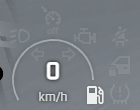

# A dashboard for FiveM

A dashboard with a clean but complete design.



## Requirements

Works with **[vehicles](https://github.com/TrAsKiN/vehicles)** for better performance.

If you want to use it as a standalone, you have to register callback functions to activate some features.

### Registering callback functions

```lua
exports.hud:registerSeatbeltFunction(function ()
    return seatbelt -- a boolean if the seat belt is attached
end)
```

```lua
exports.hud:registerSpeedLimitFunction(function ()
    return speedLimit -- a number corresponding to the speed limit in km/h
end)
```

# License

License under consideration...
